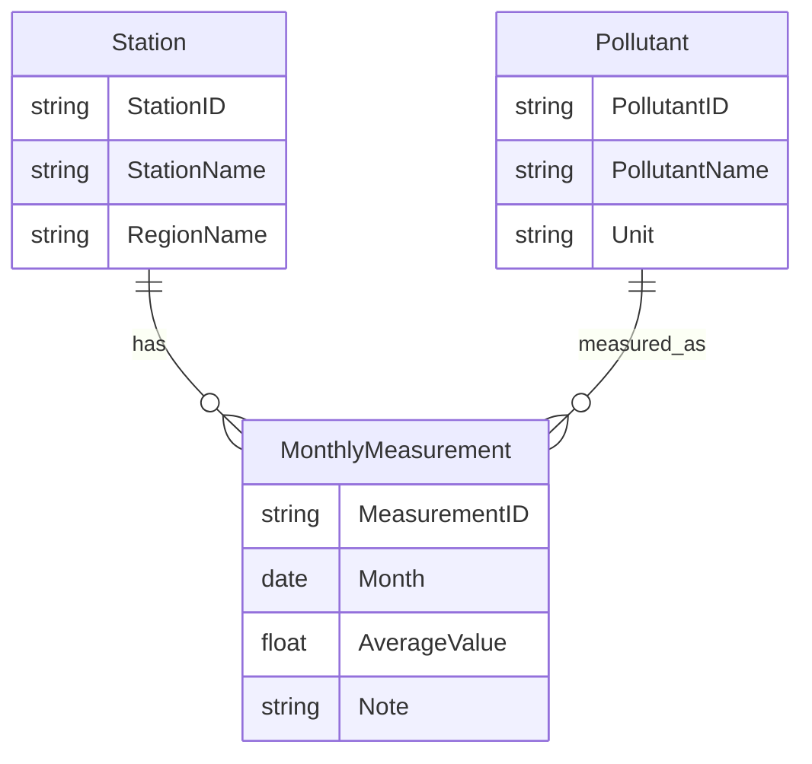

# Air Pollution Dataset Assessment

資料來源：

```text
C:\Users\Rachel\Downloads\monthly_average_air_pollution_dataset.csv
```

## 1. 資料概況

這份 CSV 是 Big5 編碼，PowerShell 直接讀取會出現亂碼。正確解碼後可讀為：

```text
月平均值查詢-基隆
資料時間：2026年
```

欄位：

| 欄位 | 說明 |
|---|---|
| `測項` | 污染物 / 監測項目 |
| `日期` | 月份，格式如 `2026/01` |
| `平均值` | 該月平均濃度 |
| `單位` | ppm / ppb / μg/m3 |
| `備註` | 目前皆為空 |

資料量：

| 項目 | 數量 |
|---|---:|
| 測站 / 地點 | 1，基隆 |
| 年份 | 2026 |
| 月份 | 5 個月，2026/01 至 2026/05 |
| 測項 | 11 |
| 總資料列 | 55 |

測項：

```text
CH4, CO, NMHC, NO, NO2, NOx, O3, PM10, PM2.5, SO2, THC
```

## 2. 初步統計

| 測項 | 單位 | 筆數 | 最小值 | 最大值 | 平均 |
|---|---|---:|---:|---:|---:|
| CH4 | ppm | 5 | 2.07 | 2.16 | 2.112 |
| CO | ppm | 5 | 0.23 | 0.33 | 0.274 |
| NMHC | ppm | 5 | 0.04 | 0.07 | 0.048 |
| NO | ppb | 5 | 1.49 | 2.67 | 1.784 |
| NO2 | ppb | 5 | 7.36 | 10.00 | 8.380 |
| NOx | ppb | 5 | 8.95 | 12.72 | 10.218 |
| O3 | ppb | 5 | 31.37 | 37.15 | 34.516 |
| PM10 | μg/m3 | 5 | 20.70 | 26.70 | 23.760 |
| PM2.5 | μg/m3 | 5 | 9.00 | 14.20 | 12.040 |
| SO2 | ppb | 5 | 1.00 | 1.34 | 1.156 |
| THC | ppm | 5 | 2.12 | 2.24 | 2.174 |

## 3. 是否適合 NoSE 測試？

這份資料適合做 **NoSE pipeline 的 toy dataset**，但不適合直接作為 performance benchmark。

原因：

- 資料量太小，只有 55 rows。
- 只有一個測站，缺少跨地區 / 跨測站查詢。
- 時間粒度是 monthly average，不是高頻 time-series。
- 沒有實際 application workload，只能由我們自行定義查詢情境。

但它很適合用來測試：

- 如何把現實資料轉成 entity graph。
- 如何設計 workload-driven NoSQL schema。
- NoSE pipeline 是否能套到非 RUBiS 的領域資料。
- 報告中作為「延伸應用」範例。

## 4. 建議 Conceptual Model



對應到目前資料：

| Entity | 目前 cardinality |
|---|---:|
| Station | 1 |
| Pollutant | 11 |
| MonthlyMeasurement | 55 |

若未來納入全台測站，`Station` 與 `MonthlyMeasurement` 會大幅增加，才更接近 NoSE 適合處理的場景。

## 5. 建議 Workload

可先定義以下查詢作為 NoSE 測試 workload：

| 編號 | 查詢情境 | 可能 access pattern |
|---|---|---|
| Q1 | 查某測項在基隆的月平均趨勢 | `PollutantID + StationID -> Month ordered measurements` |
| Q2 | 查基隆某月份所有測項 | `StationID + Month -> pollutant values` |
| Q3 | 查基隆 PM2.5 在某時間區間的數值 | `StationID + PollutantID + Month range` |
| Q4 | 查某月份最高 / 最低污染項目 | `StationID + Month -> all pollutant values + app-side sort` |
| Q5 | 新增某測站某測項某月份平均值 | insert/update measurement |

這些 workload 會導向幾個可能的 Cassandra column families：

```text
measurements_by_station_pollutant_month
measurements_by_station_month
measurements_by_pollutant_month
latest_or_monthly_summary_by_station
```

## 6. 和 RUBiS 的差異

| 面向 | RUBiS | 空污資料 |
|---|---|---|
| domain | 拍賣網站 | 環境監測 |
| workload | 論文已定義 | 需要我們自定義 |
| data size | 可放大到數千萬 rows | 目前只有 55 rows |
| relation richness | users/items/bids/comments 多關聯 | station/pollutant/measurement 較簡單 |
| benchmark suitability | 適合重現論文 evaluation | 適合展示 NoSE pipeline extension |

## 7. NoSE advisor 測試結果

目前已建立 NoSE DSL 檔案：

```text
workspace/air_pollution/air_pollution_model.rb
workspace/air_pollution/air_pollution_workload.rb
```

測試指令：

```powershell
docker run --rm -v D:/Database_Project/NoSE-Reproduction/workspace/air_pollution:/work nose-repro-advisor-release bundle exec nose search /work/air_pollution_workload.rb --no-interactive --read-only
```

結果已保存於：

```text
experiments/results/air_pollution_read_only.txt
```

NoSE 成功為這份空污 workload 產生 2 個 index：

| Index | Partition / hash fields | Sort / order fields | Projected fields | Size |
|---|---|---|---|---:|
| `i1771458373` | `Pollutant.PollutantID` | `MonthlyMeasurement.Month`, `MonthlyMeasurement.MeasurementID` | `MonthlyMeasurement.AverageValue`, `MonthlyMeasurement.Note` | 5390 |
| `i3444539955` | `Station.StationID` | `MonthlyMeasurement.Month`, `MonthlyMeasurement.MeasurementID`, `Pollutant.PollutantID` | `MonthlyMeasurement.AverageValue`, `Pollutant.PollutantName`, `Pollutant.Unit` | 4620 |

NoSE query plan 可覆蓋 3 個 read workload：

| Group | 查詢意義 | 使用 index |
|---|---|---|
| `PollutantTrend` | 查某污染物的月份趨勢 | `i1771458373` |
| `StationMonthlySummary` | 查某測站某月份所有測項 | `i3444539955` |
| `StationPollutantRange` | 查某測站某污染物的月份區間 | `i3444539955` + filter |

本次使用 `--read-only`，因此 `InsertMonthlyMeasurement` 不會出現在 query plan 中。這是刻意的，因為先確認 read workload 可以被 NoSE 分析；後續若要測 insert/update，再另開一次包含 write workload 的設定。

這代表：這份 CSV 已經能被轉換成 NoSE 可分析的資料模型與 workload，但這還不是 Cassandra 實際資料載入測試。

## 8. 結論

這份資料可以作為 NoSE 延伸測試的第一個 toy dataset，但不應拿來取代 RUBiS 做論文複現。

建議定位：

```text
RUBiS = 論文複現主線
Air Pollution = 現代應用延伸 / pipeline illustration
```

下一步可以把這份資料轉成：

1. UTF-8 normalized CSV。
2. NoSE model DSL。
3. NoSE workload DSL。
4. 小型 Cassandra schema / loader prototype。
