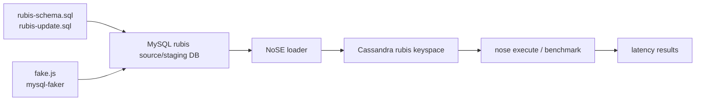

# Dataset / Data Loading Plan

## 1. 先釐清：論文是否有現成 dataset？

目前官方 NoSE repo 提供的是 RUBiS 實驗的資料生成流程，而不是一份可直接下載匯入的完整 dataset dump。

官方位置：

```text
upstream/NoSE/experiments/rubis/
```

其中包含：

| 檔案 | 用途 |
|---|---|
| `README.md` | RUBiS experiment 操作說明 |
| `rubis-schema.sql` | 建立 MySQL RUBiS source/staging schema |
| `rubis-update.sql` | 更新 / 補充 MySQL source/staging schema |
| `rubis-truncate.sql` | 清空 RUBiS tables |
| `fake.js` | 使用 `mysql-faker` 產生 synthetic RUBiS data |
| `package.json` | Node.js dependency：`mysql-faker` |

## 2. 論文中的 RUBiS dataset 規模

`fake.js` 中的資料量設定如下：

| Table | Rows |
|---|---:|
| `categories` | 500 |
| `regions` | 50 |
| `users` | 200,000 |
| `items` | 2,000,000 |
| `bids` | 20,000,000 |
| `comments` | 10,000,000 |
| `buynow` | 2,000,000 |

這與論文 Section 9 的 RUBiS experiment 對應。

## 3. 為什麼現在還不能直接丟 dataset 測？

因為官方 repo 的 latency experiment 不是單純讀一份資料檔，而是需要三層工程環境：

```text
MySQL source/staging database
  ↓  NoSE loader
Cassandra target database
  ↓  NoSE execution / benchmark
Response time measurement
```

這裡要特別注意：MySQL 不是論文方法的核心資料庫，也不是 NoSE schema advisor 的目標系統。論文方法的目標是 Cassandra-like extensible record store。MySQL 只是在官方實驗實作中被拿來作為 RUBiS synthetic data 的來源/staging database，方便 NoSE loader 將資料轉進 Cassandra column families。

官方 experiment README 也明確要求：

- Cassandra cluster，keyspace named `rubis`
- MySQL cluster，database named `rubis`
- `nose.yml` 設定 Cassandra / MySQL connection

目前我們已完成的是：

- Docker 可用。
- NoSE advisor-only image 可用。
- EAC read-only advisor 已跑通。

尚未完成的是：

- MySQL container。
- Cassandra container。
- RUBiS data generation。
- NoSE loader 將 MySQL data 載入 Cassandra。
- Benchmark runner。

所以現在可以跑「schema advisor」測試，但還不能跑「完整 dataset latency benchmark」。

## 4. 建議資料集架設順序

### Phase D1: 小規模 RUBiS smoke dataset

先不要直接跑論文規模，因為官方規模非常大：

- 20M bids
- 10M comments
- 載入 Cassandra 可能耗時數小時

建議先修改或包裝 `fake.js`，產生小規模資料：

| Table | Smoke Scale |
|---|---:|
| `users` | 1,000 |
| `items` | 5,000 |
| `bids` | 20,000 |
| `comments` | 10,000 |
| `buynow` | 5,000 |

目標不是重現論文數字，而是驗證：

- MySQL schema 可建立。
- fake data 可生成。
- NoSE loader 可執行。
- Cassandra schema 可建立。
- benchmark command 可跑。

### Phase D2: 中規模資料

等 smoke test 成功後，再提高到：

- users: 10,000
- items: 100,000
- bids: 1,000,000

目標是觀察趨勢與 runtime。

### Phase D3: 論文規模資料

最後才嘗試官方 `fake.js` 原始設定：

- users: 200,000
- items: 2,000,000
- bids: 20,000,000
- comments: 10,000,000

這一階段可能需要：

- 足夠磁碟空間。
- 長時間執行。
- Cassandra tuning。
- snapshot / restore 流程。

## 5. 後續 Docker Compose 目標

建議新增一份 compose，至少包含：

```text
nose-advisor / nose-runner
mysql-rubis
cassandra-rubis
```

資料流程：



## 6. 結論

可以開始準備 dataset pipeline，但不建議現在直接上論文規模。

合理下一步：

1. 先建立 MySQL staging + Cassandra target 的 Docker Compose。
2. 改造 `fake.js` 支援 scale 參數。
3. 先跑 smoke dataset。
4. 確認 load / benchmark 全流程後再逐步放大。

## 7. 實作狀態

目前已新增 Docker Compose：

```text
docker-compose.yml
```

服務：

- `mysql-rubis`: MySQL 5.7，source/staging RUBiS database，不是 NoSE 的目標資料庫。
- `cassandra-rubis`: Cassandra 2.1，target column-family database。
- `nose-runner`: Ruby / NoSE / MySQL client / Cassandra driver。
- `rubis-generator`: Node.js / mysql-faker data generator。

目前採用 `cassandra:2.1`，因為 Docker Hub 上沒有可直接使用的 `cassandra:2.0.9` manifest。這一點需要在報告中標註為 Cassandra version approximation。

已驗證：

- MySQL container healthy。
- Cassandra container healthy。
- MySQL RUBiS schema 可初始化。
- Cassandra `rubis` keyspace 可建立。
- 小規模 RUBiS synthetic data 可寫入 MySQL。
- `nose create rubis_baseline` 可在 Cassandra 建立 baseline column families。

目前發現：

- 官方 `rubis-update.sql` 會在資料生成前設定 `categories.dummy` / `regions.dummy`。
- 但 synthetic data 是後來插入的，所以新資料的 dummy 欄位會是 `NULL`。
- Cassandra partition key 不接受 null，因此 `nose load rubis_baseline` 會在 `all_categories` / `all_regions` 這類 index 失敗。

已新增補救腳本：

```bash
rubis-fix-generated-data
```

它會在資料生成後執行：

```sql
UPDATE categories SET dummy = 1 WHERE dummy IS NULL;
UPDATE regions SET dummy = 1 WHERE dummy IS NULL;
```

也新增：

```bash
rubis-reset-cassandra
```

用於清空並重建 Cassandra `rubis` keyspace，方便重新測試 load。
