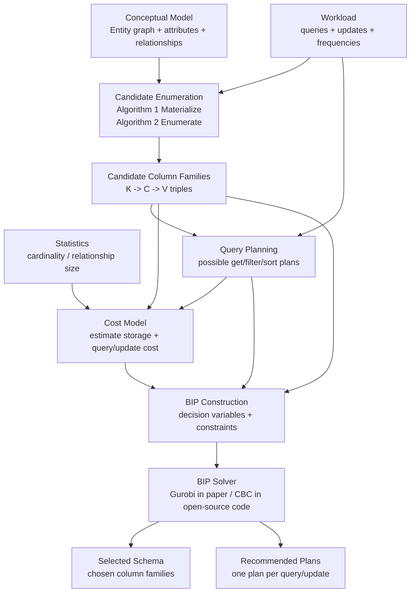

# NoSE Pipeline 導讀

這份文件把 NoSE 論文中的 schema advisor 流程整理成較容易向老師說明的版本。

## 1. Pipeline 總覽



## 2. 用一句話說明每個階段

| 階段 | 白話說法 | 論文位置 |
|---|---|---|
| Conceptual Model | 先把應用程式資料模型畫成 entity graph | Section 3.1 |
| Workload | 告訴系統有哪些查詢/更新，以及各自多常發生 | Section 3.2 |
| Candidate Enumeration | 根據 workload 列舉可能有用的 denormalized column families | Section 4.1 |
| Query Planning | 對每個 query 找出可用哪些 column family 回答 | Section 4.2 |
| Cost Model | 估算每個 plan 和 column family 的成本 | Section 6 |
| BIP Optimization | 用整數規劃在成本和空間限制下選最佳 schema | Section 5 |
| Plan Recommendation | 對每個 query/update 輸出實際建議的執行計畫 | Section 4 / 5 / 7 |

## 3. Pipeline 的核心觀念

NoSE 的核心不是單純「產生 Cassandra schema」，而是把 NoSQL schema design 變成 optimization problem。

一般人工設計 Cassandra schema 時，常見做法是：

```text
看 query pattern -> 手動設計 denormalized tables -> 手動調整
```

NoSE 做的是：

```text
query/update workload -> 自動列舉候選 tables -> 自動估成本 -> 用 BIP solver 選 schema
```

因此它比較像「physical design advisor」，而不是普通 ORM 或 migration tool。

## 4. 對應官方程式碼

目前有兩條程式碼路線：

| 路線 | 狀態 | 用途 |
|---|---|---|
| `nose-cli` + Rubygems `nose 0.1.4` | 已用 Docker 跑通 EAC read-only | 第一條可執行複現路線 |
| `nose-cli` + 本地 `NoSE main / nose 0.2.0` | 依賴版本尚未完全相容 | 後續 source-level 對照 |

重要檔案大致如下：

| Pipeline 階段 | 官方 repo 位置 |
|---|---|
| Model DSL | `upstream/NoSE/lib/nose/model.rb`、`upstream/NoSE/models/` |
| Workload DSL | `upstream/NoSE/lib/nose/workload.rb`、`upstream/NoSE/workloads/` |
| Query parser | `upstream/NoSE/lib/nose/parser.rb` |
| Candidate enumeration | `upstream/NoSE/lib/nose/enumerator.rb` |
| Column family / index 表示 | `upstream/NoSE/lib/nose/indexes.rb` |
| Query planning | `upstream/NoSE/lib/nose/plans/` |
| BIP problem | `upstream/NoSE/lib/nose/search/problem.rb` |
| BIP constraints | `upstream/NoSE/lib/nose/search/constraints.rb` |
| Update support | `upstream/NoSE/lib/nose/statements/update.rb` |
| Cost model | `upstream/NoSE/lib/nose/cost/` |
| CLI | `upstream/nose-cli/lib/nose_cli/search.rb` |

## 5. 目前已跑通的最小驗證

已成功建立 Docker image：

```powershell
docker build -f workspace\Dockerfile.advisor-release -t nose-repro-advisor-release .
```

已成功執行 EAC read-only：

```powershell
docker run --rm nose-repro-advisor-release bundle exec nose search eac --read-only --no-interactive
```

輸出結果已保存：

```text
D:\Database_Project\NoSE-Reproduction\experiments\results\eac_read_only.txt
```

目前結果：

- 3 個 indexes。
- 5 條 query plans。
- Total size: `391380000`。
- Total cost: `20`。

## 6. 老師可能會問的問題

### Q1. 這是不是只能用 Cassandra？

論文實作以 Cassandra extensible record store 為目標，但 pipeline 本身比較抽象。只要某個 NoSQL database 可以被建模為：

```text
partition key -> clustering/order key -> values
```

就有機會套用類似思想。

### Q2. 為什麼需要 BIP？

因為 column family 候選很多，而且每個候選會同時影響：

- 查詢成本
- 更新成本
- storage size
- query plan 可行性

人工很難全面比較，所以論文把它轉成 binary integer programming。

### Q3. 哪些部分最難精準複現？

- Cassandra 2.0.9 的舊環境。
- 論文使用 Gurobi，但開源實作用 CBC。
- Cost model calibration 腳本不完整。
- RUBiS latency 數字高度受硬體、JVM、磁碟與 Cassandra 設定影響。

### Q4. 對現代中小企業是否實用？

直接採用 NoSE 的成本偏高，但它的觀念仍有價值：

- 先從 workload 出發設計 NoSQL schema。
- 明確比較 read/write/storage trade-off。
- 把 denormalization 視為有成本的選擇，而不是憑直覺亂加。

